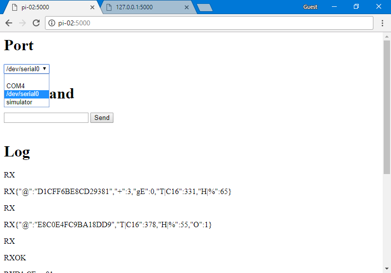

# pi-rev11-web-console

An asynchronous web interface to probe a REV11 stats hub when directly connected to a Raspberry Pi

## Overview

Built on python3, flask, SocketIO for RaspberryPi or Windows

## Setup

1. [Reconfigure serial port UART0 on the Pi](#reconfigure-serial-port-uart0-on-the-pi)
2. [Install prerequisite components](#Install-prerequisite-components)

## Reconfigure serial port UART0 on the Pi

Before we can access serial port UART0 from our code, we need reconfigure the Pi so it does not claim UART0 at boot up as a serial console shell.

See section [RaspberryPi Serial - Setting up the Pi](https://github.com/opentrv/OTWiki/wiki/RaspberryPi-Serial#setting-up-the-pi) in the wiki.

## Install prerequisite components

Before the web server can be run, we need to ensure that several components are installed, including

* Python3
* [Flask](http://flask.pocoo.org/) micro web server

These will be installed for you, if you run the following command on your Pi:

`bash install.sh`

This can take several minutes.
